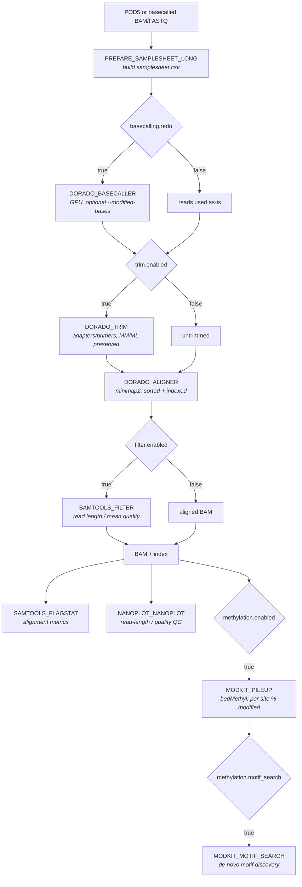
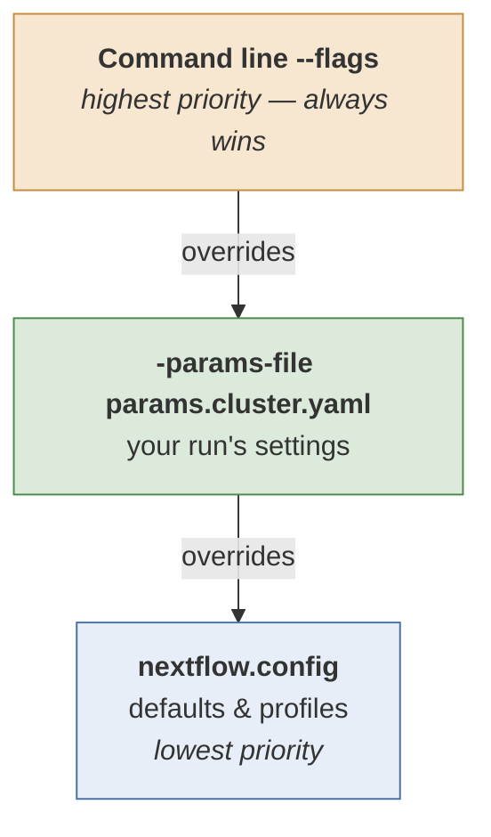

# nf-dnaseq-ont

A Nextflow pipeline for Oxford Nanopore (ONT) long-read DNA-seq: optional GPU re-basecalling with **modified-base calling**, adapter trimming, alignment, read filtering, and QC. It runs on a SLURM cluster with Apptainer containers.

Because basecalling is done with Dorado, the pipeline can call **5mC / 6mA directly from the raw signal** and carry those calls through alignment as `MM`/`ML` tags — no bisulfite, no special library prep.

This guide is written for researchers who want to run the pipeline on their own data on the cluster.

---

## What the pipeline does



**Stages at a glance:**

| Stage | Tool | Runs on | Optional? |
|---|---|---|---|
| Basecalling | `dorado basecaller` | GPU | yes — `basecalling.redo` |
| Trimming | `dorado trim` | GPU queue | yes — `trim.enabled` |
| Alignment | `dorado aligner` (minimap2) | GPU queue | no |
| Filtering | `samtools view -e` | CPU | yes — `filter.enabled` |
| QC | `samtools flagstat`, `NanoPlot` | CPU | no |
| Per-site methylation | `modkit pileup` | CPU | yes — `methylation.enabled` |
| Motif discovery | `modkit motif search` | CPU | yes — `methylation.motif_search` |

> **Note:** re-basecalling is by far the most expensive step — expect **6–20 hours per barcode** on one GPU with a `sup` model plus a modification model. If your reads are already basecalled with the mods you want, set `basecalling.redo: false` and start from the BAM.

---

## TLDR: Run it on the cluster

You do **not** need to clone the repo to run the pipeline. Nextflow can pull it straight from GitHub, so a run is four steps: make a working directory, fetch the params file, edit it, submit.

### 1. Go to the folder where you want your results

Nextflow writes `work/` (large, temporary) and your `outdir` relative to wherever you launch it, so start in that directory. For example, if your dataset is called `my-ont-run`:

```bash
# !! Change this to your dataset name !!
dataset_name=my-ont-run
```

```bash
mkdir -p /mnt/lustre/users/$USER/data/$dataset_name
cd /mnt/lustre/users/$USER/data/$dataset_name
```

### 2. Fetch the params file

```bash
curl -O https://raw.githubusercontent.com/EIT-GBI/nf-dnaseq-ont/main/params.cluster.yaml
```

### 3. Edit it for your data

```bash
nano params.cluster.yaml     # or vim, or edit it in your interactive session.
```

At minimum set `samplesheet` (or `reads_dir` + `reference_genome`), `reference_dir`, and `outdir`. If you are re-basecalling, also check `basecalling.model` and `basecalling.modified_bases`. See [Key parameters](#key-parameters).

### 4. Submit the run

```bash
sbatch -J nf-driver -p cpu -t 5-00:00:00 \
  --wrap="nextflow run https://github.com/EIT-GBI/nf-dnaseq-ont.git -latest \
    -params-file params.cluster.yaml -profile cluster -resume"
```

Then watch it with `squeue -u $USER`, and read the driver's log with `tail -f slurm-<jobid>.out`.

### What each part does

| Part | What it does |
|---|---|
| `sbatch` | Submits the job to SLURM and returns immediately. The job survives you logging out. |
| `-J nf-driver` | Job **name**. This job is only the Nextflow *driver* — it submits and babysits the real work; the actual tools run in their own separate jobs. |
| `-p cpu` | **Partition** (queue) for the driver. The driver itself is tiny, so `cpu` is right even though basecalling is GPU — the Dorado steps request the `gpu` partition themselves. |
| `-t 5-00:00:00` | Walltime for the **driver**. It must outlive the whole pipeline. ONT runs are long, and a 24-hour default will kill it mid-run. |
| `--wrap="..."` | Runs this command instead of you writing a `#SBATCH` script file. Everything inside the quotes is what actually executes on the node. |
| `nextflow run <url>` | Pulls the pipeline from GitHub and runs it. No clone needed — Nextflow caches it under `~/.nextflow/assets/`. |
| `-latest` | Re-pull the newest commit on the default branch. Without this, Nextflow silently reuses whatever it cached the first time, so you'd miss bug fixes. |
| `-params-file params.cluster.yaml` | Your inputs and settings (the file you edited in step 3). |
| `-profile cluster` | SLURM executor + Apptainer containers. |
| `-resume` | Reuse cached results from previous runs. Always safe to include. |

> **If the driver hits its walltime, every running task is orphaned and its work is lost** — those tasks are never cached, so `-resume` restarts them from scratch. Be generous with `-t`.

### Why `sbatch` and not just running it in the terminal

The cluster is still under active development, and `tmux` sessions and login pods have been getting killed unpredictably. If the Nextflow driver dies mid-run, the jobs it already submitted are orphaned and you have to clean up and `-resume`. With basecalling taking many hours per sample, that is expensive. Handing the driver to SLURM avoids it entirely.

### Alternative: run it in a tmux session

If your run is small, you want to watch the progress bars live, and you don't mind the risk of being disconnected:

```bash
tmux new -s nf              # start a named session
nextflow run https://github.com/EIT-GBI/nf-dnaseq-ont.git -latest \
  -params-file params.cluster.yaml -profile cluster -resume
```

Detach with `Ctrl-b` then `d`, and come back later with `tmux attach -t nf`. If the session does get killed, re-run the same command with `-resume` — completed tasks are cached.

---

## Preparing your inputs

You give the pipeline reads in one of **two ways**:

### Option A — point it at a reads directory (easiest)

Set `reads_dir` and `reference_genome`, leave `samplesheet: null`, and the pipeline builds the samplesheet for you. Accepted files:

```
<sample>.fastq.gz   <sample>.fq.gz   <sample>.fastq   <sample>.fq   <sample>.bam
```

The sample name is the filename with the suffix stripped.

> This mode does **not** discover POD5 directories. If you are re-basecalling (`basecalling.redo: true`), use Option B.

### Option B — provide your own samplesheet

Set `samplesheet` to a CSV with these columns:

```csv
sample,reads,reference
RMC,/abs/path/pod5_pass/barcode41,misc/simon_methylation/RMC.fa
wt,/abs/path/pod5_pass/barcode42,misc/simon_methylation/wt.fa
```

| Column | Meaning |
|---|---|
| `sample` | Sample name; used for output filenames and the process `tag` |
| `reads` | POD5 **directory** (when `basecalling.redo: true`), or a basecalled BAM/FASTQ (when `false`) |
| `reference` | Path **relative to `reference_dir`** |

Each sample can use a different reference — useful when comparing engineered strains.

> Entirely blank rows (trailing `,,` lines, common in exported CSVs) are skipped automatically. A row with *some* fields filled and `reads` empty still fails loudly, which is intended.

### Reference genome layout

References live under `reference_dir`, and each `reference` column entry is the path **relative** to it. For example, with:

```yaml
reference_dir: "/mnt/gbi-shared/.../references/"
```

and a samplesheet entry of `misc/simon_methylation/wt.fa`, the pipeline resolves
`/mnt/gbi-shared/.../references/misc/simon_methylation/wt.fa`.

Each reference **must be pre-indexed**:

| File | Needed for |
|---|---|
| `*.fa.fai` | `dorado aligner` (and everything downstream) |

Build it once with `samtools faidx genome.fa`. Every reference in the samplesheet is resolved when the run starts, so a missing index fails within seconds rather than after hours of basecalling. To check ahead of time:

```bash
for f in $reference_dir/**/*.fa; do [ -f "$f.fai" ] || echo "MISSING INDEX: $f"; done
```

Avoid `(`, `)`, spaces and non-ASCII characters in reference filenames — they are interpolated unquoted into shell commands.

---

## Key parameters

These live in `params.cluster.yaml`:

| Parameter | Meaning |
|---|---|
| `samplesheet` | Path to a samplesheet CSV, or `null` to build one from `reads_dir` |
| `reads_dir` | Directory of reads (used when `samplesheet: null`) |
| `reference_genome` | Reference FASTA relative to `reference_dir` (used when `samplesheet: null`) |
| `reference_dir` | Root directory holding reference genomes + `.fai` indexes |
| `outdir` | Where published results go |
| `basecalling.redo` | `true` → reads are raw POD5 and get re-basecalled on GPU; `false` → reads are already basecalled |
| `basecalling.model` | Path to a model baked into the container, or a bare model name (Dorado downloads it — needs internet on the node) |
| `basecalling.modified_bases` | Space-separated mod models, e.g. `'6mA'`, `'5mCG_5hmCG'`, `'5mCG_5hmCG 6mA'`. Empty string = canonical bases only |
| `alignment.tool` | `dorado` (only option implemented) |
| `alignment.device` | Validated but **not yet used** — all Dorado steps run on the GPU queue |
| `trim.enabled` | Run `dorado trim` before alignment |
| `filter.enabled` | Apply the read-level filter after alignment |
| `filter.min_read_length` | Minimum read length (bp) |
| `filter.min_read_quality` | Minimum mean base quality |
| `methylation.enabled` | Run `modkit pileup` to produce per-site bedMethyl |
| `methylation.motif_search` | Additionally run `modkit motif search` for de novo motifs |

### Models baked into `ghcr.io/eit-gbi/nf-mod-dorado`

```
/opt/models/dna_r10.4.1_e8.2_400bps_sup@v5.0.0    -> supports 5mCG_5hmCG, 6mA
/opt/models/dna_r10.4.1_e8.2_400bps_hac@v5.0.0    -> supports 6mA
```

`sup` is more accurate and several times slower than `hac`. Use `hac` for quick checks.

---

## Modified bases

When `basecalling.modified_bases` is set, every read carries its methylation calls as SAM tags:

| Tag | Contents |
|---|---|
| `MM:Z` | *Which* bases were called — e.g. `A+a?,12,45,3,...` (`A` = adenine, `a` = 6mA; the numbers are skip counts, not coordinates) |
| `ML:B:C` | *How confident* each call is — one `uint8` per called position; probability ≈ `(value + 0.5) / 256` |

Both `dorado trim` and `dorado aligner` preserve these tags, and `samtools view -e` filtering keeps them intact. Check they survived:

```bash
samtools view -F 0x900 results/aligned/SAMPLE.sorted.bam | head -1 \
  | tr '\t' '\n' | grep -E '^(MM|ML):'
```

> `-F 0x900` excludes secondary and supplementary alignments, which do not carry these tags.
>
> Never round-trip through plain FASTQ without `samtools fastq -T MM,ML` — the calls are silently lost.

### From per-read tags to per-site calls

A single read is one noisy observation. `MODKIT_PILEUP` stacks every read covering each reference position and reports the **fraction of reads methylated** there, as a bedMethyl file:

| Column | Contents |
|---|---|
| 1–3 | chrom, start (0-based), end |
| 4 | modification code (`a` = 6mA, `m` = 5mC) |
| 6 | strand — **keep strands separate for 6mA**; it is not symmetric like CpG |
| 10 | valid coverage |
| 11 | percent modified |

Check the threshold modkit chose for itself:

```bash
grep -i threshold $outdir/methylation/SAMPLE.modkit_pileup.log
```

It is set at the 10th percentile of per-call *confidence*, so a value near 0.8 means 90% of calls are more than 80% confident. Pin it explicitly if the automatic choice looks wrong:

```groovy
withName: 'MODKIT_PILEUP' { ext.args = '--filter-threshold 0.8' }
```

Then plot the distribution of per-site percentages. A working experiment is **bimodal** — a large mass near 0% and a distinct mass near 100%:

```bash
awk '$4=="a" && $10>=20 {b=int($11/10); c[b]++} END {for(i=0;i<10;i++) printf "%3d-%3d%%  %8d\n", i*10, i*10+9, c[i]}' \
  $outdir/methylation/SAMPLE.bedmethyl.bed
```

A smear across the middle bins means the calls are not separating methylated from unmethylated, and motif discovery downstream will be noise.

### Motif discovery

`MODKIT_MOTIF_SEARCH` takes the bedMethyl plus the reference and asks which sequence pattern is enriched among highly-methylated positions relative to assessed-but-unmethylated ones. Output is one TSV per sample:

```
mod_code  motif           offset  frac_mod  high_count  low_count  mid_count
a         GAAYNNNNNNRTTC  2       1         428         0          0
```

`offset` is the 0-based position of the methylated base within the motif; `frac_mod` is the fraction of matched occurrences that are methylated. Motifs use IUPAC codes (`R` = A/G, `Y` = C/T, `N` = any). A bipartite motif with a fixed `N` spacer — as above — is the signature of a Type I restriction–modification system.

**Interpretation needs a control.** Basecalling models have sequence-context biases, so a spurious motif appears in *every* sample. A genuine enzymatic signal disappears when the enzyme is deleted — compare a knockout against its parent.

---

## Overriding parameters

A parameter can be set in three places. They form **layers**, and higher layers win:



> **config  <  params-file  <  command line**

### Examples

Skip re-basecalling for one run (reads are already basecalled):

```bash
nextflow run main.nf -params-file params.cluster.yaml -profile cluster \
  --basecalling.redo false -resume
```

Call a different modification set:

```bash
nextflow run main.nf -params-file params.cluster.yaml -profile cluster \
  --basecalling.modified_bases '5mCG_5hmCG 6mA' -resume
```

Loosen the read filter:

```bash
nextflow run main.nf -params-file params.cluster.yaml -profile cluster \
  --filter.min_read_length 500 --filter.min_read_quality 8 -resume
```

**Gotchas:**
- Nested params use dotted notation: `--basecalling.redo false`.
- Values with spaces must be quoted: `--basecalling.modified_bases '5mCG_5hmCG 6mA'`.
- The examples are written as `nextflow run main.nf` for brevity, i.e. from a clone. Running from GitHub, swap that for `nextflow run https://github.com/EIT-GBI/nf-dnaseq-ont.git -latest` and wrap the whole thing in `sbatch --wrap="..."` as above.

---

## Outputs

Results are published under `outdir`:

```
outdir/
├── samplesheet/          # generated samplesheet.csv (Option A only)
├── basecalled/           # unaligned BAM with MM/ML tags (when redo: true)
├── trimmed/              # adapter-trimmed unaligned BAM
├── aligned/              # sorted BAM + .bai
├── filtered/             # length/quality-filtered BAM + .bai
├── methylation/          # bedMethyl (per-site % modified) + pileup logs
│   └── motifs/           # de novo motif TSVs + search logs
└── qc/
    ├── flagstat/         # samtools flagstat metrics
    └── nanoplot/         # NanoPlot HTML reports
```

**Always verify published BAMs after a run.** If a run is aborted mid-publish, the copy can be left truncated while its index still looks complete:

```bash
samtools quickcheck -v $outdir/*/*.bam
```

Anything listed is truncated; the intact copy is still in that task's `work/` directory.

---

## GPU notes

The `cluster` profile puts all Dorado steps on the GPU queue:

```groovy
withName: 'DORADO_BASECALLER' {
    cpus             = 8
    memory           = '96 GB'
    accelerator      = 1
    clusterOptions   = '--gres=gpu:1'   // keep count == accelerator
    queue            = 'gpu'
    containerOptions = '--nv'           // exposes host GPUs to the container
    errorStrategy    = 'retry'
    maxRetries       = 2
    time             = '48 h'
}
```

Keep the **GPU count consistent** between `--gres` and `accelerator`.

`time = '48 h'` matters: without it, jobs inherit a 24-hour default that silently kills long basecalls near the finish line. `memory = '96 GB'` likewise — a `sup` + mod model run can sit against a 48 GB ceiling for a full day and never complete.

`dorado trim` and `dorado aligner` are CPU-only tools but currently also request a GPU; that is wasteful and on the TODO list.

---

## Troubleshooting

| Symptom | Likely cause / fix |
|---|---|
| `Argument of file() function cannot be empty` | A samplesheet row with an empty `reads` column. Fully blank rows are skipped automatically; this means a partially-filled one |
| `No such file or directory: <ref>.fa.fai` (within seconds of starting) | Missing reference index → `samtools faidx <ref>.fa` for every reference in the samplesheet |
| `Failed to pull singularity image … 403 Forbidden` | Private GHCR package with no registry auth on the node → `apptainer remote login --username <user> docker://ghcr.io`, then pre-pull into `apptainer.cacheDir` |
| `No POD5 or FAST5 data found in path: <dir>` | The reads path is not bound into the container → add the mount to `apptainer.runOptions` (e.g. `-B /mnt/instrument-data`) |
| `Failed to get read N signal: null output parameter passed to C API` | POD5 data not fully readable — truncated files, or a network/object-storage mount serving partial reads. Verify with `du -sh` vs `du -sh --apparent-size`, and stage the data to local/fast storage |
| Job killed at exactly 24 h with exit 140 | Default walltime → set `time` on the process **and** `-t` on the driver |
| `samtools quickcheck` flags a published BAM | Publish copy interrupted by an aborted run → recover from the task's `work/` directory |
| `Invalid include source: .../modules/...` | Submodules not checked out → `git submodule update --init --recursive` |
| Dorado: `'<model path>' is not a supported modification` | `--modified-bases` swallowed the positional args. It takes a variable-length list, so it must come **after** the model and reads |

---

## TODO list
- [x] Wire `MODKIT_PILEUP` and `MODKIT_MOTIF_SEARCH` into `main.nf` for per-site methylation and motif discovery.
- [ ] Add a targeted motif-scoring process (score named motifs per sample, all candidate offsets).
- [x] Validate reference `.fai` files at workflow start instead of after basecalling.
- [ ] Chunk basecalling by POD5 group so a failure costs minutes rather than a whole barcode.
- [ ] Move `dorado trim` / `dorado aligner` off the GPU queue.
- [ ] Implement the `alignment.device` CPU path (minimap2), or remove the parameter.
- [ ] Include `conf/base.config` (currently never loaded) and add MultiQC + coverage (mosdepth) to QC.
- [x] Add sbatch and tmux instructions for cluster runs.
